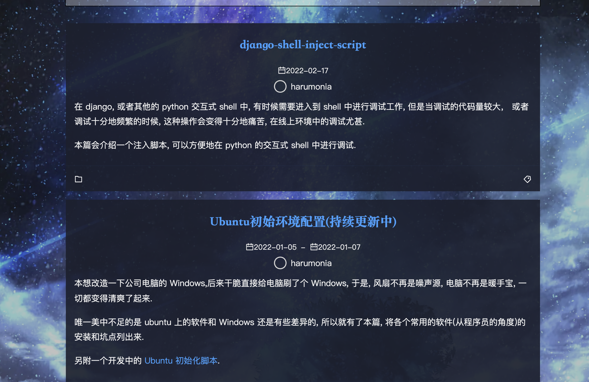
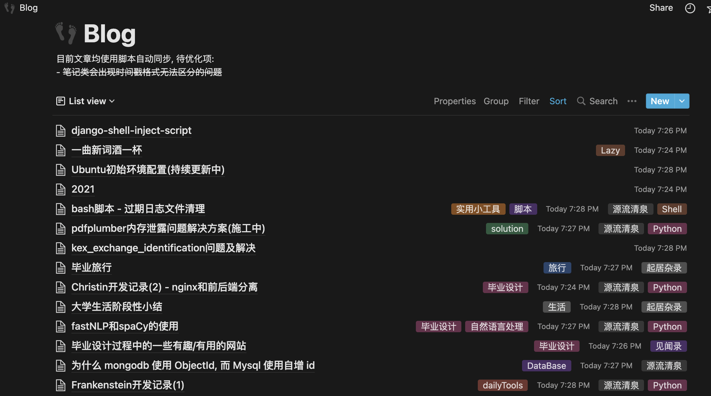

# NoteTrail

<!-- In memory of a lost love and happy birthday to me -->

convert markdown directory to notions.

将 markdown (`*.md`) 目录结构的电子书导入到 __notion__ 中.

项目可以用来做什么?

- [markdown目录结构的书导入至notion](#markdown目录结构的书)
- [hexo博客迁移至notion](#hexo博客迁移至notion)

样例展示: [我的notion主页](https://harumonia.notion.site/Harumonia-e1d77980f1b942beb0ac80c3f3448a8d)

## 关于使用

项目使用[notion api](https://developers.notion.com/)来实现脚本导入.

使用项目之前需要预设环境变量:

- NOTION_TOKEN: 从创建 [api integrations](https://www.notion.so/my-integrations) 用户, 并将其 _token_ 作为环境变量值
- (可选)项目使用阿里云来存储图片, 所以需要阿里云对应的oss调用 _AccessKey_, [阿里云OSS](https://oss.console.aliyun.com/overview), [AccessKey管理](https://ram.console.aliyun.com/users).
  - ALI_OSS_AK: 本变量的值对应 __AccessKey ID__
  - ALI_OSS_SK: 本变量的值对应 __AccessKey Secret__.
  - ALI_BUCKET: bucket的url, 如 'https://example-oss-bucket.oss-cn-region.aliyuncs.com/'

## markdown目录结构

### 使用方法

在 __./watson/book_processor.py__ 中填入对应的参数.

### 关于样例

| github | notion |
|---|---|
|[ddd笔记](https://github.com/zq99299/note-book2/tree/master/docs/ddd)|[notion样例](https://harumonia.notion.site/ddd-9c90bf7e622e4d0bbfdf2768e06561e5)
|[you-dont-know-js](https://github.com/getify/You-Dont-Know-JS)|[notion样例](https://harumonia.notion.site/You-Dont-Know-JS-77771cc3b4bb4a1787a4a99d272634ce)
|[how-to-cook](https://github.com/Anduin2017/HowToCook)|[notion样例](https://harumonia.notion.site/how-to-cook-801c4df3c9e640df8667e8533fe1a457)
|[sdn](https://github.com/feiskyer/sdn-handbook)|[notion样例](https://harumonia.notion.site/sdn-handbook-ac76e75768d24f6dbfb44b0ced3cb3b9)

## hexo博客迁移至notion

!!!  迁移请确保语法符合markdown规则 !!!

对于不符合markdown语法规则的, 可以在输出的日志中找到对应的文件.

### 使用方法

在 __./watson/hexo/hexo.py__ 中填入对应的参数.

### 样例展示

[博客地址](https://blog.harumonia.moe/)

[notion地址](https://harumonia.notion.site/5dfca79037874290b22dec916bdc9f07?v=7c41717134644508b4288d9acc90ca98)

## TODO

- [ ] blocks
  - [x] code
  - [x] p
  - [x] ul
  - [x] ol
  - [x] headers(h1\h2\h3...)
  - [x] rich-text
  - [x] picture
  - [x] table
  - [ ] html block
  - [ ] html span
- [ ] add logger
- [ ] add sqlite to store notion-db __ ebook map relation, for update
- [x] refactor block class
- [x] pic management (oss)
- [ ] page version control
- [ ] toc
- [ ] more properties (unread, pinned, ...)
- [ ] block render class and validate block
- [ ] catch failed block render and log
- [ ] 使用命令行进行操作