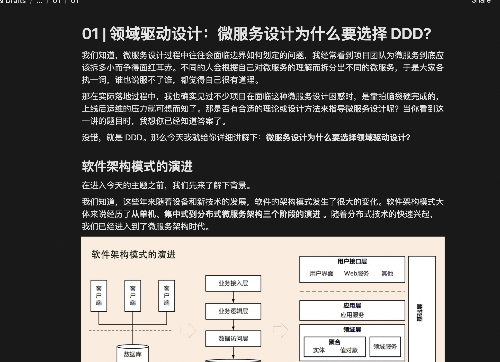
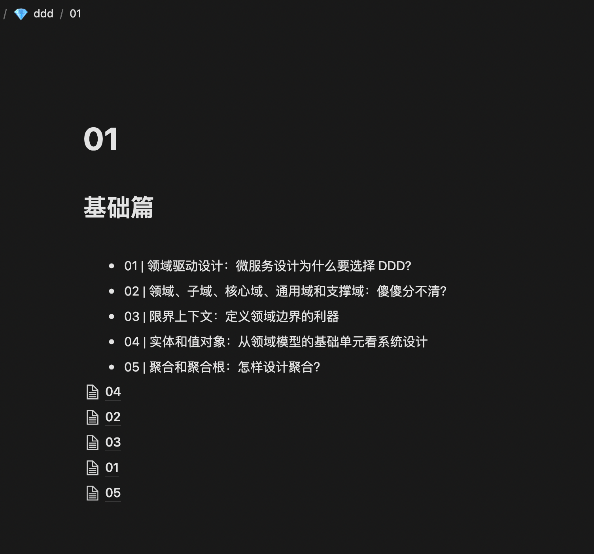

# NoteTrail

convert markdown directory to notions.

将 markdown (`*.md`) 目录结构的电子书导入到 __notion__ 中.

项目可以用来做什么?

- [markdown目录结构的书](#markdown目录结构的书)
- [hexo博客迁移至notion](#hexo博客迁移至notion)

样例展示: [我的notion主页](https://harumonia.notion.site/Harumonia-e1d77980f1b942beb0ac80c3f3448a8d)

## 关于使用

项目使用[notion api](https://developers.notion.com/)来实现脚本导入.

使用项目之前需要预设3个环境变量:

- NOTION_TOKEN: 从创建 [api integrations](https://www.notion.so/my-integrations) 用户, 并将其 _token_ 作为环境变量值
- ALI_OSS_AK: 项目使用阿里云来存储图片, 所以需要阿里云对应的oss调用 _AccessKey_. [阿里云OSS](https://oss.console.aliyun.com/overview), [AccessKey管理](https://ram.console.aliyun.com/users). 本变量的值对应 __AccessKey ID__
- ALI_OSS_SK: 同上. 本变量的值对应 __AccessKey Secret__.

## markdown目录结构的书

### 关于使用

在 __book_processor.py__ 中填入对应的参数.

### 关于样例

使用 [ddd项目](https://github.com/zq99299/note-book2/tree/master/docs/ddd) 进行测试.

目前还存在一些BUG, 如目录相关的逻辑还在构思.

## hexo博客迁移至notion

!!!  迁移请确保语法符合markdown规则 !!!

对于不符合markdown语法规则的, 可以在输出的日志中找到对应的文件.

### 使用方法

在 __hexo.py__ 中填入对应的参数.

### 样例展示

[博客地址](https://blog.harumonia.moe/)

[notion地址](https://harumonia.notion.site/5dfca79037874290b22dec916bdc9f07?v=7c41717134644508b4288d9acc90ca98)

## TODO

- [x] blocks
  - [x] code
  - [x] p
  - [x] ul
  - [x] ol
  - [x] headers(h1\h2\h3...)
  - [x] rich-text
  - [x] picture
  - [x] table
- [ ] add logger
- [ ] add sqlite to store notion-db __ ebook map relation, for update
- [x] refactor block class
- [x] pic management (oss)
- [ ] page version control
- [ ] toc
- [ ] more properties (unread, pinned, ...)
- [ ] block render class and validate block
- [ ] catch failed block render and log
- [ ] 使用命令行进行操作
